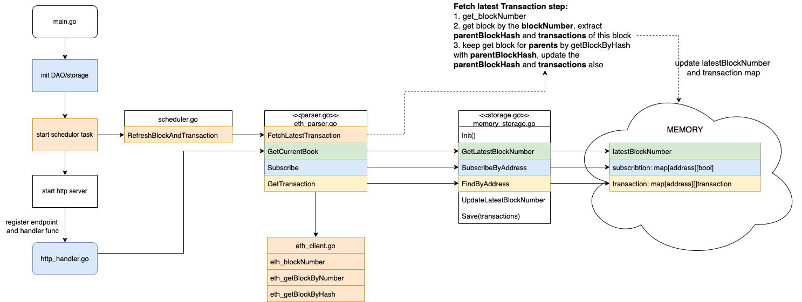

# Ethereum blockchain Transaction parser

## Pre-requisites
* golang 1.19

## Solution Architecture

0) main.go -> initialize server resources
   1) initialize dao, 
   2) start scheduler which runs every 12 seconds to fetch latest block and then extract and store transactions
   3) start http server to listen to client and serve requests
1) http_handler.go -> handler of http requests
2) parser.go & eth_parser.go -> parser and implementation for eth
   1) the data will be loaded from Memory directly so that to support high volumn requests
3) storage.go & memory_storage.go -> dao and dao based on memory implementation
   1) memory_storage.go maintains key data structure used to serve requests
      1) latestBlockNumber: current block number
      2) addressTransactionsMap: key is address and value is transactions of this address
      3) subscriptionMap: maintains subscription relationship, only subscribed address is able to get transactions
4) eth_client.go -> the client to access ETH server
5) scheduler.go 
   1) runs every 12 seconds to fetch latest block and then extract and update the data structure in dao

## How to run and test locally

### 1. start server by main.go
you should be able to find below logs in console if start server successfully
```
2023/11/02 19:46:38 Memory TransactionDAO initialise start
2023/11/02 19:46:38 Memory TransactionDAO initialise finished
2023/11/02 19:46:38 RefreshBlockAndTransaction start
2023/11/02 19:46:38 RefreshBlockAndTransaction finish

```
### 2. Test endPoint with curl
#### 2.1 Get Current Block Number
```
// request
curl "http://127.0.0.1:8080/get-current-block"

// response
{"blockNumber":18483859}
```
#### 2.2 Subscribe address to get Transaction
```
// request
curl "http://127.0.0.1:8080/subscribe?address=0xafa5f9313f1f2b599173f24807a882f498be118c"

// response
{"success":true}
```
#### 2.3 Get Transaction by address
```
// request
curl "http://127.0.0.1:8080/get-transactions?address=0xafa5f9313f1f2b599173f24807a882f498be118c"

//response
{"transactions":[{"blockHash":"0x8a968bb797360806707991fbf7f7c60d262e97d16f12a34b0184d860da6d0796","blockNumber":"0x11a0a9b","gas":"0x389d5","gasPrice":"0x4181354a8","maxFeePerGas":"0x41f457cda","maxPriorityFeePerGas":"0x2faf080","hash":"0xc08de8960c1256bff62129c2c660e7690d99537e2caa970f7af100fc59c01d77","input":"0x126928c40000000000000000000000000000000000000000000000000000000000000091000000000000000000000000000000000000000000000000000000000000006000000000000000000000000000000000000000000000000000000000000000a00000000000000000000000000000000000000000000000000000000000000014ee9135a1241b37335445bb9aab85f4662407a01d000000000000000000000000000000000000000000000000000000000000000000000000000000000000005600020000000000000000000000000000000000000000000000000000000000030d400000000000000000000000000000000000000000000000000000024ffa005e00ee9135a1241b37335445bb9aab85f4662407a01d00000000000000000000","nonce":"0x49","from":"0xee9135a1241b37335445bb9aab85f4662407a01d","to":"0xafa5f9313f1f2b599173f24807a882f498be118c","transactionIndex":"0x10f","value":"0x1d12a0316f55c","type":"0x2","chainId":"0x1"}]}
```
If request to get transaction of non-subscribed address, you would not be able to get transactions
```
// response
{"transactions":null}
```